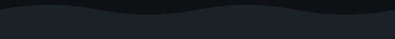

<div align="center">


<br>

<a href="https://github.com/vitormaximianoxs">
  
</a>

</div>

<br>


## `> sobre_mim.js`

```javascript
const vitor = {
  papel: "Desenvolvedor Front-end",
  foco: ["Interfaces limpas", "Sistemas internos", "Design & UI"],
  formacao: "Técnico em Informática — ETEC Itaquera",
  estilo: "Aplicações single-file, rápidas e sem dependências pesadas",
  statusAtual: "Sempre construindo algo novo 🚀"
};
```

<br>

## `> stack.config`

<div align="center">


</div>

<br>


## `> estatísticas.exe`

<div align="center">


<br><br>


</div>

<br>

## `> atividade.log`

<div align="center">

<!-- snake animation: gerada automaticamente pela GitHub Action (veja instruções abaixo) -->


</div>

<br>


## `> contato.sh`

<div align="center">

<!-- troque os # pelos seus links reais -->
[](#)
[](#)
[](#)

<br><br>


</div>


